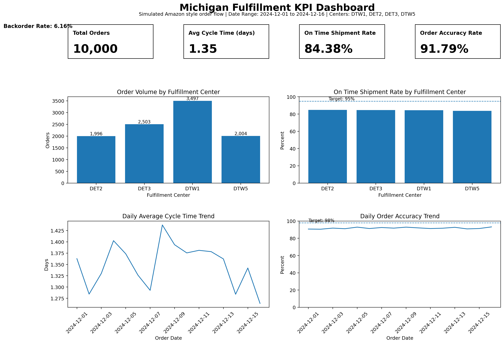

# Fulfillment KPI Dashboard

An interactive analytics dashboard built with Python and Streamlit that simulates fulfillment operations across multiple Michigan distribution centers.

## Overview
This project models end to end fulfillment performance using realistic operational metrics commonly used by supply chain, operations, and analytics teams. The dashboard is designed to resemble an internal decision support tool used to monitor operational health and identify performance gaps.

The application allows users to explore performance trends, compare fulfillment centers, and evaluate key metrics against defined targets.

## Live Demo
https://fulfillment-kpi-dashboard-bushra.streamlit.app/

## Key Performance Areas
- Order cycle time  
- On time shipment rate  
- Order accuracy  
- Backorder rate  

## Key Features
- Interactive filtering by fulfillment center and order date range  
- KPI summary cards with performance deltas versus targets  
- Fulfillment center level performance comparison  
- Daily trend analysis for cycle time and accuracy  
- Downloadable filtered dataset for further analysis  
- Clean dark themed interface optimized for executive and analyst use  

## Technologies Used
- Python  
- Pandas  
- Plotly  
- Streamlit  

## Data and Logic
The dataset is programmatically generated to simulate realistic fulfillment behavior across Michigan based fulfillment centers. All metrics are calculated using business logic aligned with real world fulfillment and operations analytics definitions to ensure consistency and meaningful performance trends.

Fulfillment centers included:
- DTW1  
- DET2  
- DET3  
- DTW5  

## Screenshot


## How to Run Locally
```bash
git clone https://github.com/Busrah25/fulfillment-kpi-dashboard.git
cd fulfillment-kpi-dashboard
pip install -r requirements.txt
streamlit run app.py
```

### Future Improvements
- Integration with real fulfillment or WMS data  
- Additional KPI drill downs by SKU or carrier  
- Role based dashboard views for operations and leadership  
- Exportable executive summary reports  
