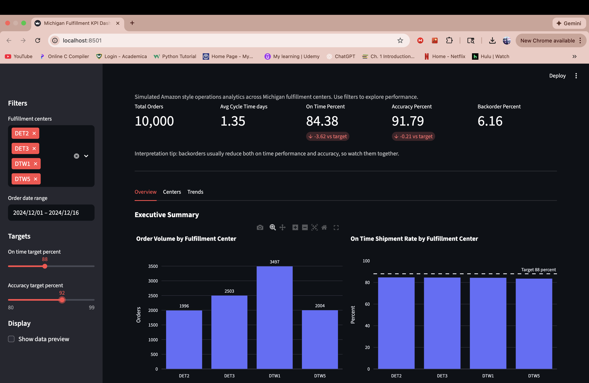

# Fulfillment KPI Dashboard

An interactive fulfillment analytics dashboard built with Python and Streamlit that simulates Amazon style fulfillment operations across Michigan fulfillment centers.

## Overview
This project models end to end fulfillment performance using realistic operational metrics commonly used by supply chain, operations, and analytics teams. The dashboard is designed to resemble an internal decision support tool used for monitoring operational health and identifying performance gaps.

Key performance areas include:
- Order cycle time
- On time shipment rate
- Order accuracy
- Backorder rate

The application allows users to explore performance trends, compare fulfillment centers, and evaluate metrics against defined targets.

## Key Features
- Interactive filters by fulfillment center and order date range
- KPI summary cards with performance deltas versus targets
- Fulfillment center level performance comparison
- Daily trend analysis for cycle time and accuracy
- Downloadable filtered dataset for further analysis
- Clean, dark themed UI optimized for executive and analyst use

## Technologies Used
- Python
- Pandas
- Plotly
- Streamlit

## Data
The dataset is programmatically generated to simulate realistic fulfillment behavior across Michigan based fulfillment centers:
- DTW1
- DET2
- DET3
- DTW5

All metrics are calculated using business logic aligned with real world fulfillment and operations analytics definitions. The data generation process ensures consistency, realistic distributions, and meaningful performance trends.

## Dashboard Preview


## How to Run Locally

1. Clone the repository:
   ```bash
   git clone https://github.com/Busrah25/fulfillment-kpi-dashboard.git
   cd fulfillment-kpi-dashboard
